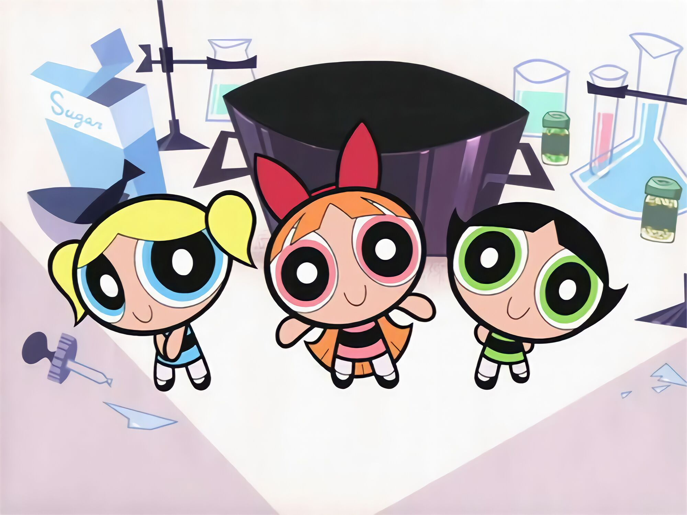

<h1 align="center">The Powerpuff Girls App - 1998</h1>
<p align="center">
	
</p>

---
##### Made this project as a job assignment


🔗 | 1. git clone this repository
```terminal
git clone https://github.com/Alpakash/the-powerpuff-girls-es6.git
```

💻 | 2. Install the project dependencies
```
npm install
```

▶ | 3. Start the node server and watch the ES6 SPA
```
npm start
```
